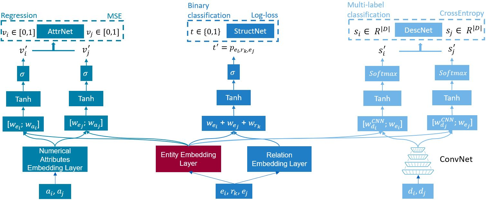
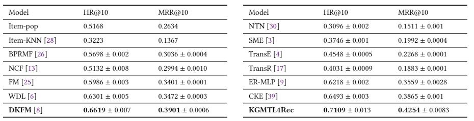

# KGMTL4Rec

A python implementation of KGMTL4Rec model proposed in Predicting your next trip: A Knowledge Graph-Based Multi-task learning Approach for Travel Destination Recommendation. Submitted to the International 2021 RecTour Workshop held in conjunction with RecSys'21 Conference (RecTour'21).



# Software dependencies

This project has a number of software dependencies, listed in the requirements.txt file: 

numpy==1.19.2 
pandas==0.24.1
pykg2vec==0.0.51
scikit-learn==0.24
scipy==1.5.4
torch==1.7.1
torchvision==0.8.2
tqdm==4.54.1
tensorflow==2.4.1


# Directories structure 

|    Directory    |                         Content                                |
|-----------------|----------------------------------------------------------------|
|[src](https://gitlab.eurecom.fr/amadeus/KGMTL4Rec/-/tree/master/src) | Folder that contains the main file to train and evaluate KGMTL4REC |
|[KGMTL4REC](https://gitlab.eurecom.fr/amadeus/KGMTL4Rec/-/tree/master/KGMTL4Rec) | Folder that contains KGMTL4REC model implementation of pytorch and other useful python functions |
|[KG_models](https://gitlab.eurecom.fr/amadeus/KGMTL4Rec/-/tree/master/KG_models) | Folder that contains Knowledge graph-based Models evaluation framework |
|[sota_models](https://gitlab.eurecom.fr/amadeus/KGMTL4Rec/-/tree/master/sota_models) | Folder that contains CF, Hybrid and CA recommender systems|
|[ontology](https://gitlab.eurecom.fr/amadeus/KGMTL4Rec/-/tree/master/ontology) | Folder that contains the travel ontology used to create the KG |

## Dataset
The dataset used in the paper is not available for obvious privacy reasons and the use of it is GDPR compliant. We believe that our model KGMTL4REC can be applied to other datasets (which will be one of our future work). We consider though that it is worth publishing the source code that allowed us to run the experiments and obtain the results presented in the paper. 

## Knowledge graph-based models
### Learning Embeddings
KG embeddings are generated through [pykg2vec](https://github.com/Sujit-O/pykg2vec) python package. Please refer to the documentation provided in [pykg2vec documentation](https://pykg2vec.readthedocs.io/en/latest/start.html). The dataset used should be in the format of triples (h,r,t), one should have three files for each dataset (train, val, test).

Run pykg2vec train file:
```
#!/usr/bin/env bash
python train.py -mn [KG embeddings algorithm] -ds [name] -dsp [path_storing_text_files] -hpf [path_to_hyperparameter_yaml]
```

### Recommendation Ranking and evaluation
Once KG embeddings generated, you could use evaluation.py script to evaluate the KG-based models. You can choose the hyper-parameters based on argument list provided in the file. We provide below an example to run the evaluation script:

Run evaluation:
```
#!/usr/bin/env bash
python evaluation.py --ds [path-to-dataset] --nb_hist [Number of historical travels*] --hit [Top-K] --embd_size [KG embeddings size]
```
Number of historical travels*: Considers only travelers that have more than 

## Sota Models 
CF, hybrid and context-aware recommender systems are implemented in tensorflow 2 and located in sota_models folder. We detail below how we can train and evaluate the different recommender systems.

Run Most popular (currently in production dataset):
```
#!/usr/bin/env bash
python mostPop.py
```

Run implicit MF or BPR MF:
```
#!/usr/bin/env bash
python implicitMF.py -mn [MF Model*] -ds [path-to-dataset] -factors_size [size of latent factors] -iterations [nb iterations of the model]
```

MF Model*:e.g. "implicitMF" or "BPRMF"

Run all other models (e.g. NCF, WDL, DKFM), you can run several models using:
```
#!/usr/bin/env bash
pykg2vec-train -mn [Models*] -ds [path-to-dataset] -Ns [Nb negative samples] -batch_size [batch size] -epochs [nb epochs] -lr [learning rate] -embd_size [embedding size] -K [top-K]
```

Models*: e.g. "NCF;MLP" or "FM;WDL;DKFM"

## KGMTL4REC
To train and evaluate (validation dataset) KGMTL4REC, you need to go to src folder and run main.py script. In main.py we call several class and functions defined at KGMTL4rec folder.

Run main file to train and evaluate KGMTL4REC:
```
#!/usr/bin/env bash
python main.py -ds [path-to-dataset] -Ns [Nb negative samples] -batch_size [batch size] -epochs [nb epochs] -lr [learning rate] -embd_size [embedding size] -K [top-K]
```
The list and description of all parameters is given in the main.py file.

## Results
The experiments ran on the Travel dataset has shown the good performance of our model, we give below a table that present the results:


